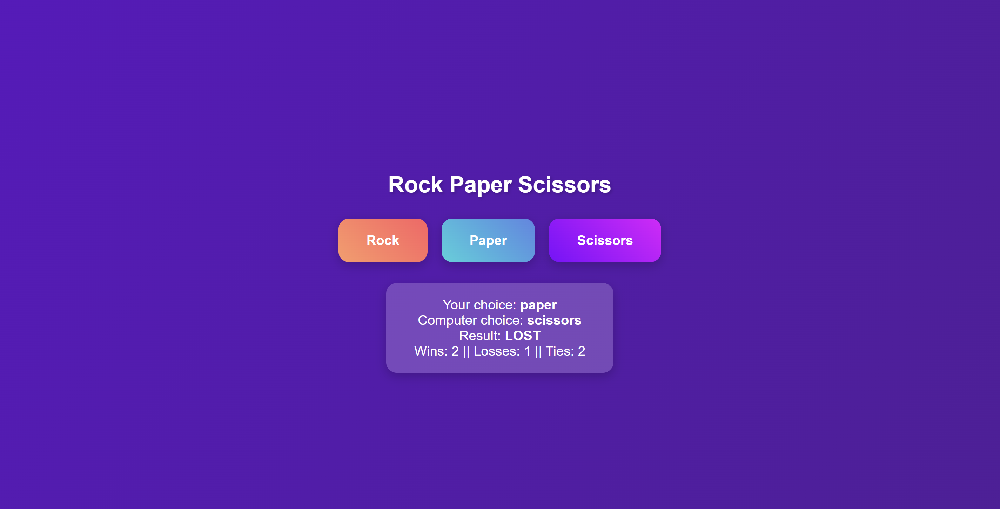

## Rock Paper Scissors Game

An interactive and visually appealing Rock Paper Scissors web game built using HTML, CSS, and JavaScript.  
Challenge your luck and track your score as you play against the computer with smooth animations and a sleek UI.

---

### Live Demo
[https://www.linkedin.com/in/sagarpani/](https://sagarpani.github.io/Rock_Paper_Scissors/)

---

### Features
- Classic Rock–Paper–Scissors gameplay  
- Real-time score tracking (Wins / Losses / Ties)  
- Smooth gradient background animation  
- Interactive button effects and hover transitions  
- Responsive and clean UI  

---

### Tech Stack
| Technology | Purpose |
|-------------|----------|
| HTML5 | Structure of the game |
| CSS3 | Styling, gradients, animations |
| JavaScript (ES6) | Game logic and score handling |

---

### How to Run Locally
1. Clone the repository
    ```bash
    git clone https://github.com/sagarpani/Rock_Paper_Scissors.git

2. Navigate into the folder
    cd Rock_Paper_Scissors

3. Open the game
    Simply open index.html in your browser.


### Game Logic Overview
    -The computer randomly selects rock, paper, or scissors.
    -The player chooses one by clicking a button.
    -The game determines the winner and updates the score accordingly:
        1. Rock beats Scissors
        2. Paper beats Rock
        3. Scissors beats Paper
        4. Identical choices = Tie

### Preview
    

### Future Enhancements
    -Add sound effects on win/loss
    -Include player vs player mode
    -Store scores using localStorage
    -Add restart and reset buttons

### Author
    Sagar Pani
    Frontend Developer | Learner | Builder
    Connect on GitHub
    [Github](https://github.com/sagarpani)
    Connect on Linkedin
    [LinkedIn](https://www.linkedin.com/in/sagarpani)